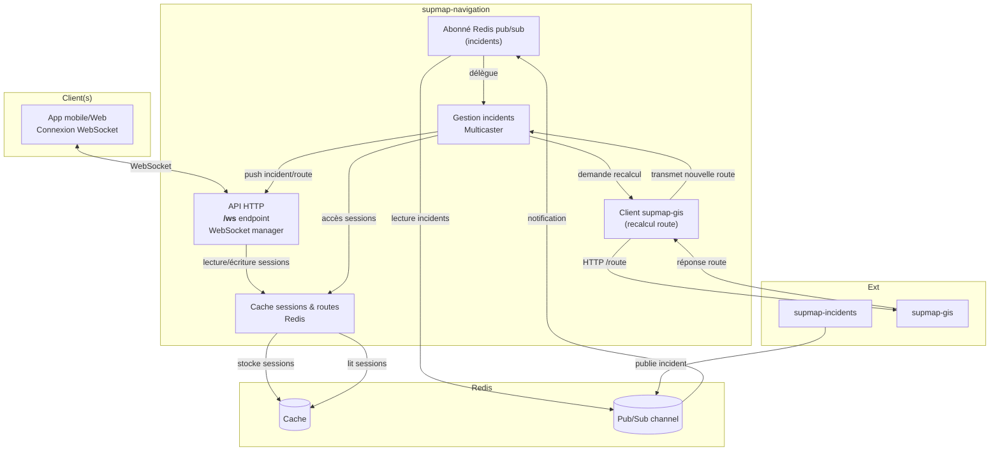

# supmap-navigation

## 1. Introduction

### 1.1. Rôle du microservice

**supmap-navigation** est le microservice dédié à la gestion de la navigation en temps réel pour les utilisateurs de l’application Supmap. Il établit et maintient des connexions WebSocket avec les clients mobiles afin de :
- Suivre en direct la position de chaque utilisateur pendant leur trajet.
- Diffuser instantanément les nouveaux incidents signalés sur leur itinéraire.
- Gérer les recalculs de route à la volée en cas d’événement perturbateur (ex : accident, embouteillage).

### 1.2. Principales responsabilités

- **Connexion WebSocket et gestion de session :**  
  Chaque client ouvre une connexion WebSocket identifiée par un `session_id` unique (UUID). Le serveur conserve en cache les informations de navigation et les positions des clients grâce à Redis.

- **Suivi de position :**  
  Les clients envoient régulièrement leur position. Le service met à jour le cache et peut ainsi déterminer à tout moment l’avancement de l’utilisateur sur son trajet.

- **Diffusion d’incidents en temps réel :**  
  Lorsqu’un nouvel incident est détecté ou modifié (via le microservice supmap-incidents), supmap-navigation est notifié via un canal Pub/Sub Redis. Il transmet alors en temps réel l’incident aux clients concernés, c’est-à-dire ceux dont l’itinéraire croise la zone de l’incident.

- **Recalcul dynamique des itinéraires :**  
  Si un incident nécessite le recalcul de la route (incident bloquant et certifié…), le service interroge supmap-gis pour obtenir un nouvel itinéraire. Ce nouvel itinéraire est ensuite envoyé au(x) client(s) via la connexion WebSocket, assurant une navigation optimisée en permanence.

### 1.3. Technologies et dépendances externes

- **Go** : langage principal du microservice.
- **WebSocket** : communication temps réel bidirectionnelle avec les clients.
- **Redis** : 
  - Stockage temporaire (cache) des sessions, routes et positions clients.
  - Mécanisme Pub/Sub pour recevoir en direct les incidents depuis supmap-incidents.
- **supmap-gis** : microservice utilisé pour le recalcul d’itinéraires en cas d’incident bloquant.
- **supmap-incidents** : source des incidents signalés sur le réseau via Redis Pub/Sub.
- **GitHub Actions** : CI pour build/push l’image Docker sur le registre GHCR du repo.

---

## 2. Architecture générale

### 2.1. Schéma d’architecture



### 2.2. Description des interactions internes et externes

- **Client (mobile)** :  
  Ouvre une connexion WebSocket sur `/ws` avec un `session_id` (UUID généré). Envoie ses infos d’itinéraire et régulièrement sa position.

- **API HTTP / WebSocket manager** :  
  Gère l’ouverture, le cycle de vie et la fermeture des connexions WebSocket. Chaque client correspond à une session identifiée et mappée sur une instance interne.

- **Cache Redis** :
    - Stocke les sessions de navigation : dernière position, itinéraire courant.
    - Permet de récupérer l’état d’une session à tout instant, pour tous les modules (manager, incidents…).

- **Abonné Redis Pub/Sub** :
    - S’abonne au canal d’incidents publié par **supmap-incidents**.
    - À la réception d’un message d’incident, délègue la gestion au **Multicaster**.

- **Gestionnaire d’incidents (Multicaster)** :
    - Détermine quels clients (sessions actives) sont concernés par l’incident.
    - Push l’incident en temps réel uniquement aux clients concernés via WebSocket.
    - Si l’incident nécessite un recalcul de route, il interroge le service **supmap-gis**, met à jour la session et push la nouvelle route au(x) client(s) impacté(s).

- **Client supmap-gis** :
    - Interagit avec le microservice **supmap-gis** via HTTP pour recalculer un itinéraire si besoin (en cas d’incident bloquant et certifié).

- **supmap-incidents** :
    - Publie les incidents sur le canal Pub/Sub Redis, ce qui déclenche la chaîne de notifications côté navigation.

### 2.3. Présentation des principaux composants

- **API HTTP/WebSocket (internal/api, internal/ws)** :  
  Expose l’unique endpoint `/ws` pour la navigation temps réel ; chaque nouvelle connexion est gérée comme un client identifié (`session_id`).

- **Cache Redis (internal/cache)** :  
  Abstraction pour stocker et lire les objets de session. TTL configurable.

- **Gestionnaire d’incidents (internal/incidents/multicaster.go)** :  
  Logique pour déterminer si un incident touche un client, envoyer la notification et déclencher le recalcul de route si nécessaire.

- **Abonné Pub/Sub (internal/subscriber)** :  
  S’abonne au canal Redis des incidents, désérialise les messages et transmet au multicaster.

- **Client GIS (internal/gis/routing/client.go)** :  
  Client HTTP vers supmap-gis pour demander un recalcul d’itinéraire.

- **Session navigation (internal/navigation)** :  
  Struct représentant l’état d’une navigation en cours : route, position, timestamps…

---

## 3. Organisation du projet et Structure des dossiers

### 3.1. Arborescence commentée

```
supmap-navigation/
├── cmd/
│   └── main.go                  # Point d'entrée du microservice
├── internal/
│   ├── api/                     # API HTTP : serveur, handler, routing
│   │   ├── handler.go           # Handler du endpoint /ws (connexion WebSocket)
│   │   └── server.go            # Démarrage et gestion du serveur HTTP
│   ├── cache/                   # Cache des sessions de navigation (Redis)
│   │   └── redis.go             # Abstraction pour stocker/récupérer les sessions navigation
│   ├── config/                  # Chargement, parsing de la configuration (variables d'env)
│   ├── gis/                     # Fonctions géospatiales & client supmap-gis
│   │   ├── polyline.go          # Calculs/distances sur polylines (utile incidents)
│   │   └── routing/
│   │       └── client.go        # Client HTTP pour interroger supmap-gis (recalcul d'itinéraire)
│   ├── incidents/               # Gestion de la diffusion des incidents
│   │   └── multicaster.go       # Multicast incidents/nouvelles routes aux clients concernés
│   ├── navigation/              # Structures de navigation (sessions, routes, points…)
│   │   └── session.go           # Structs : Session, Position, Route, Point, etc.
│   ├── subscriber/              # Abonné Redis Pub/Sub aux incidents
│   │   ├── subscriber.go        # Logique d'abonnement et de dispatch au multicaster
│   │   └── types.go             # Types pour désérialiser les messages incidents
│   └── ws/                      # Gestion WebSocket : clients, manager, messaging
│       ├── client.go            # Logique d'un client WebSocket (lifecycle, messaging)
│       └── manager.go           # Manager central des clients WebSocket
└── ...
```

### 3.2. Rôle de chaque dossier/fichier principal

#### 3.2.1. cmd/

- **main.go**  
  Point d’entrée du service : instancie la config, connecte Redis, démarre les managers, serveurs et workers.

#### 3.2.2. internal/api/

- **server.go**  
  Serveur HTTP principal, expose `/ws` (WebSocket) et `/health`.
- **handler.go**  
  Handler pour la connexion WebSocket, gestion du handshake et vérification du paramètre `session_id`.

#### 3.2.3. internal/cache/

- **redis.go**  
  Abstraction pour stocker/récupérer une session navigation dans Redis (opérations Set/Get/Delete).

#### 3.2.4. internal/config/

- Chargement et parsing des variables d’environnement (hôtes, ports, Redis, etc).

#### 3.2.5. internal/gis/

- **polyline.go**  
  Fonctions utilitaires pour les calculs géospatiaux (distance point-polyline, etc).
- **routing/client.go**  
  Client HTTP pour appeler supmap-gis lors du recalcul d’itinéraire.

#### 3.2.6. internal/incidents/

- **multicaster.go**  
  Logique de multicasting des incidents :
    - Vérifie si un incident concerne la route d’un client.
    - Push l’incident à la session concernée.
    - Déclenche un recalcul de route si besoin.

#### 3.2.7. internal/navigation/

- **session.go**  
  Structures métier pour une session de navigation (Session, Position, Route, Point, etc).

#### 3.2.8. internal/subscriber/

- **subscriber.go**  
  S’abonne au canal Redis Pub/Sub des incidents, désérialise les messages, relaie au multicaster.
- **types.go**  
  Types pour la désérialisation des messages incidents reçus.

#### 3.2.9. internal/ws/

- **manager.go**  
  Manager WebSocket central :
    - Gère l’ensemble des clients connectés.
    - Dispatch les messages (broadcast, ciblé…).
    - Enregistrement/déconnexion.
- **client.go**  
  Représentation d’un client WebSocket individuel :
    - Gestion du lifecycle, envoi/réception de messages, ping/pong.

---
