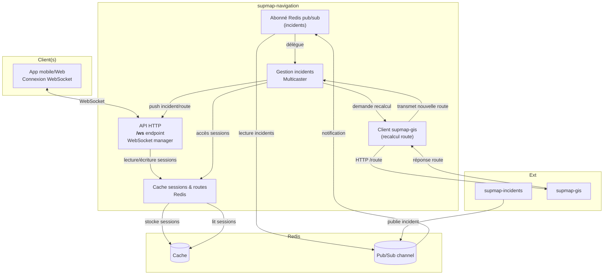
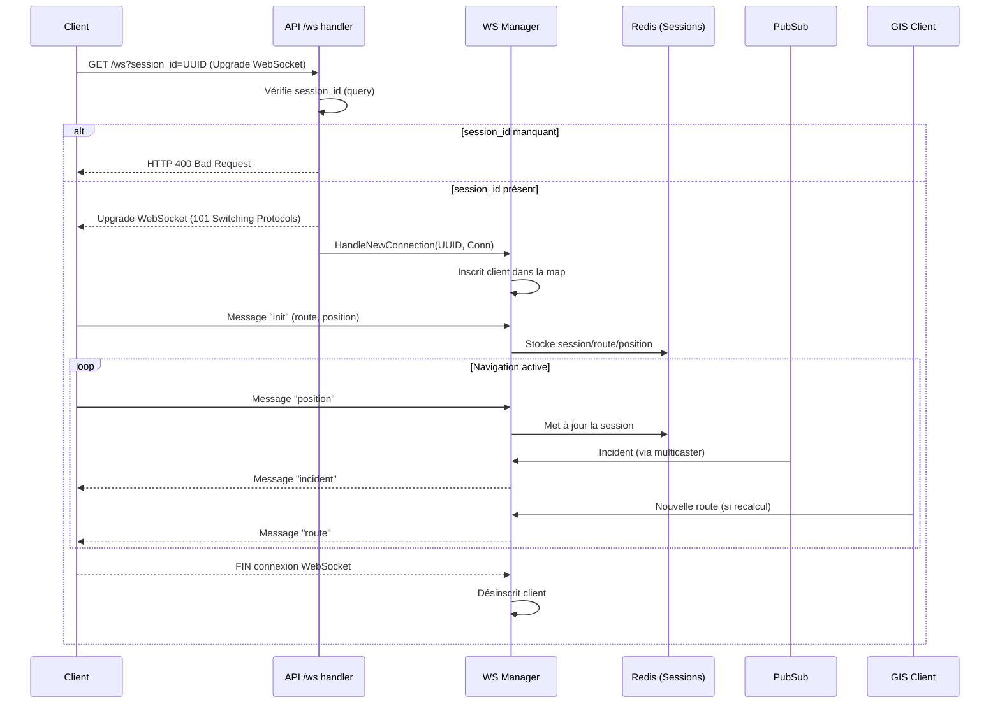

# supmap-navigation

## 1. Introduction

### 1.1. Rôle du microservice

**supmap-navigation** est le microservice dédié à la gestion de la navigation en temps réel pour les utilisateurs de l’application Supmap. Il établit et maintient des connexions WebSocket avec les clients mobiles afin de :
- Suivre en direct la position de chaque utilisateur pendant leur trajet.
- Diffuser instantanément les nouveaux incidents signalés sur leur itinéraire.
- Gérer les recalculs de route à la volée en cas d’événement perturbateur (ex : accident, embouteillage).

### 1.2. Principales responsabilités

- **Connexion WebSocket et gestion de session :**  
  Chaque client ouvre une connexion WebSocket identifiée par un `session_id` unique (UUID). Le serveur conserve en cache les informations de navigation et les positions des clients grâce à Redis.

- **Suivi de position :**  
  Les clients envoient régulièrement leur position. Le service met à jour le cache et peut ainsi déterminer à tout moment l’avancement de l’utilisateur sur son trajet.

- **Diffusion d’incidents en temps réel :**  
  Lorsqu’un nouvel incident est détecté ou modifié (via le microservice supmap-incidents), supmap-navigation est notifié via un canal Pub/Sub Redis. Il transmet alors en temps réel l’incident aux clients concernés, c’est-à-dire ceux dont l’itinéraire croise la zone de l’incident.

- **Recalcul dynamique des itinéraires :**  
  Si un incident nécessite le recalcul de la route (incident bloquant et certifié…), le service interroge supmap-gis pour obtenir un nouvel itinéraire. Ce nouvel itinéraire est ensuite envoyé au(x) client(s) via la connexion WebSocket, assurant une navigation optimisée en permanence.

### 1.3. Technologies et dépendances externes

- **Go** : langage principal du microservice.
- **WebSocket** : communication temps réel bidirectionnelle avec les clients.
- **Redis** : 
  - Stockage temporaire (cache) des sessions, routes et positions clients.
  - Mécanisme Pub/Sub pour recevoir en direct les incidents depuis supmap-incidents.
- **supmap-gis** : microservice utilisé pour le recalcul d’itinéraires en cas d’incident bloquant.
- **supmap-incidents** : source des incidents signalés sur le réseau via Redis Pub/Sub.
- **GitHub Actions** : CI pour build/push l’image Docker sur le registre GHCR du repo.

---

## 2. Architecture générale

### 2.1. Schéma d’architecture



### 2.2. Description des interactions internes et externes

- **Client (mobile)** :  
  Ouvre une connexion WebSocket sur `/ws` avec un `session_id` (UUID généré). Envoie ses infos d’itinéraire et régulièrement sa position.

- **API HTTP / WebSocket manager** :  
  Gère l’ouverture, le cycle de vie et la fermeture des connexions WebSocket. Chaque client correspond à une session identifiée et mappée sur une instance interne.

- **Cache Redis** :
    - Stocke les sessions de navigation : dernière position, itinéraire courant.
    - Permet de récupérer l’état d’une session à tout instant, pour tous les modules (manager, incidents…).

- **Abonné Redis Pub/Sub** :
    - S’abonne au canal d’incidents publié par **supmap-incidents**.
    - À la réception d’un message d’incident, délègue la gestion au **Multicaster**.

- **Gestionnaire d’incidents (Multicaster)** :
    - Détermine quels clients (sessions actives) sont concernés par l’incident.
    - Push l’incident en temps réel uniquement aux clients concernés via WebSocket.
    - Si l’incident nécessite un recalcul de route, il interroge le service **supmap-gis**, met à jour la session et push la nouvelle route au(x) client(s) impacté(s).

- **Client supmap-gis** :
    - Interagit avec le microservice **supmap-gis** via HTTP pour recalculer un itinéraire si besoin (en cas d’incident bloquant et certifié).

- **supmap-incidents** :
    - Publie les incidents sur le canal Pub/Sub Redis, ce qui déclenche la chaîne de notifications côté navigation.

### 2.3. Présentation des principaux composants

- **API HTTP/WebSocket (internal/api, internal/ws)** :  
  Expose l’unique endpoint `/ws` pour la navigation temps réel ; chaque nouvelle connexion est gérée comme un client identifié (`session_id`).

- **Cache Redis (internal/cache)** :  
  Abstraction pour stocker et lire les objets de session. TTL configurable.

- **Gestionnaire d’incidents (internal/incidents/multicaster.go)** :  
  Logique pour déterminer si un incident touche un client, envoyer la notification et déclencher le recalcul de route si nécessaire.

- **Abonné Pub/Sub (internal/subscriber)** :  
  S’abonne au canal Redis des incidents, désérialise les messages et transmet au multicaster.

- **Client GIS (internal/gis/routing/client.go)** :  
  Client HTTP vers supmap-gis pour demander un recalcul d’itinéraire.

- **Session navigation (internal/navigation)** :  
  Struct représentant l’état d’une navigation en cours : route, position, timestamps…

---

## 3. Organisation du projet et Structure des dossiers

### 3.1. Arborescence commentée

```
supmap-navigation/
├── cmd/
│   └── main.go                  # Point d'entrée du microservice
├── internal/
│   ├── api/                     # API HTTP : serveur, handler, routing
│   │   ├── handler.go           # Handler du endpoint /ws (connexion WebSocket)
│   │   └── server.go            # Démarrage et gestion du serveur HTTP
│   ├── cache/                   # Cache des sessions de navigation (Redis)
│   │   └── redis.go             # Abstraction pour stocker/récupérer les sessions navigation
│   ├── config/                  # Chargement, parsing de la configuration (variables d'env)
│   ├── gis/                     # Fonctions géospatiales & client supmap-gis
│   │   ├── polyline.go          # Calculs/distances sur polylines (utile incidents)
│   │   └── routing/
│   │       └── client.go        # Client HTTP pour interroger supmap-gis (recalcul d'itinéraire)
│   ├── incidents/               # Gestion de la diffusion des incidents
│   │   └── multicaster.go       # Multicast incidents/nouvelles routes aux clients concernés
│   ├── navigation/              # Structures de navigation (sessions, routes, points…)
│   │   └── session.go           # Structs : Session, Position, Route, Point, etc.
│   ├── subscriber/              # Abonné Redis Pub/Sub aux incidents
│   │   ├── subscriber.go        # Logique d'abonnement et de dispatch au multicaster
│   │   └── types.go             # Types pour désérialiser les messages incidents
│   └── ws/                      # Gestion WebSocket : clients, manager, messaging
│       ├── client.go            # Logique d'un client WebSocket (lifecycle, messaging)
│       └── manager.go           # Manager central des clients WebSocket
└── ...
```

### 3.2. Rôle de chaque dossier/fichier principal

#### 3.2.1. cmd/

- **main.go**  
  Point d’entrée du service : instancie la config, connecte Redis, démarre les managers, serveurs et workers.

#### 3.2.2. internal/api/

- **server.go**  
  Serveur HTTP principal, expose `/ws` (WebSocket) et `/health`.
- **handler.go**  
  Handler pour la connexion WebSocket, gestion du handshake et vérification du paramètre `session_id`.

#### 3.2.3. internal/cache/

- **redis.go**  
  Abstraction pour stocker/récupérer une session navigation dans Redis (opérations Set/Get/Delete).

#### 3.2.4. internal/config/

- Chargement et parsing des variables d’environnement (hôtes, ports, Redis, etc).

#### 3.2.5. internal/gis/

- **polyline.go**  
  Fonctions utilitaires pour les calculs géospatiaux (distance point-polyline, etc).
- **routing/client.go**  
  Client HTTP pour appeler supmap-gis lors du recalcul d’itinéraire.

#### 3.2.6. internal/incidents/

- **multicaster.go**  
  Logique de multicasting des incidents :
    - Vérifie si un incident concerne la route d’un client.
    - Push l’incident à la session concernée.
    - Déclenche un recalcul de route si besoin.

#### 3.2.7. internal/navigation/

- **session.go**  
  Structures métier pour une session de navigation (Session, Position, Route, Point, etc).

#### 3.2.8. internal/subscriber/

- **subscriber.go**  
  S’abonne au canal Redis Pub/Sub des incidents, désérialise les messages, relaie au multicaster.
- **types.go**  
  Types pour la désérialisation des messages incidents reçus.

#### 3.2.9. internal/ws/

- **manager.go**  
  Manager WebSocket central :
    - Gère l’ensemble des clients connectés.
    - Dispatch les messages (broadcast, ciblé…).
    - Enregistrement/déconnexion.
- **client.go**  
  Représentation d’un client WebSocket individuel :
    - Gestion du lifecycle, envoi/réception de messages, ping/pong.

---

## 4. Détail des services internes

### 4.1. Gestion des sessions de navigation (`internal/navigation`, `internal/cache`)

#### 4.1.1. Rôle
- Représente l’état de navigation d’un utilisateur : itinéraire courant, dernière position, timestamp de mise à jour.
- Permet de persister et de retrouver à tout instant l’état d’une session (utile pour la diffusion des incidents, le recalcul de route, etc).

#### 4.1.2. Dépendances
- **Redis** (via `internal/cache/redis.go`) pour le stockage temporaire des sessions.
- Utilisé par le WebSocket manager, le multicaster d’incidents et le subscriber.

#### 4.1.3. Principales méthodes
- **SessionCache (interface)** :
    - `SetSession(ctx, session) error` : Ajoute ou met à jour une session en cache.
    - `GetSession(ctx, sessionID) (*Session, error)` : Récupère l’état d’une session via son ID.
    - `DeleteSession(ctx, sessionID) error` : Supprime la session du cache.

### 4.2. WebSocket Manager et clients (`internal/ws`)

#### 4.2.1. Rôle
- Gère toutes les connexions WebSocket actives (un client = une session).
- Assure l’inscription/désinscription des clients, le broadcast des messages, et la gestion fine des canaux (ping/pong, déconnexions…).
- Route les messages reçus côté client (init, position) et côté serveur (incident, route recalculée).

#### 4.2.2. Dépendances
- S’appuie sur le cache session pour la persistance et la cohérence des états utilisateurs.
- Interagit avec le multicaster d’incidents pour pousser les messages incidents/routes.

#### 4.2.3. Principales méthodes
- **Manager** :
    - `Start()` : Boucle principale, écoute inscriptions/désinscriptions/messages.
    - `Broadcast(message)` : Broadcast d’un message à tous les clients.
    - `HandleNewConnection(id, conn)` : Création et démarrage d’un nouveau client WebSocket.
    - `ClientsUnsafe()`, `RLock()`, `RUnlock()` : Gestion thread-safe des clients.
- **Client** :
    - `Start()` : Démarre les goroutines de lecture/écriture pour la connexion.
    - `Send(msg)` : Envoie un message (avec gestion du buffer, déconnexion si bloqué).
    - `handleMessage(msg)` : Routage des messages reçus (init, position…).

### 4.3. API HTTP (`internal/api`)

#### 4.3.1. Rôle
- Expose l’endpoint `/ws` (WebSocket) et `/health` (vérification de vie).
- Effectue la première validation (`session_id`), puis délègue la gestion de la connexion au WebSocket manager.

#### 4.3.2. Dépendances
- WebSocket manager (gestion des connexions)

#### 4.3.3. Principales méthodes
- **Server** :
    - `Start(ctx)` : Démarrage du serveur HTTP, gestion propre du shutdown.
    - `wsHandler()` : Handler HTTP pour l’upgrade WebSocket (contrôle du paramètre `session_id`).

### 4.4. Cache Redis (`internal/cache`)

#### 4.4.1. Rôle
- Fournit un cache persistant et performant pour les sessions de navigation.
- Permet de stocker, récupérer et supprimer l’état d’une session utilisateur.

#### 4.4.2. Dépendances
- Client Redis (`github.com/redis/go-redis/v9`)
- Utilisé par le WebSocket manager, le multicaster d’incidents, et le subscriber.

#### 4.4.3. Principales méthodes/fonctions
- `NewRedisSessionCache(client, ttl)` : Constructeur de la structure cache.
- `SetSession(ctx, session)` / `GetSession(ctx, sessionID)` / `DeleteSession(ctx, sessionID)` : Opérations CRUD sur les sessions.

### 4.5. Abonné Pub/Sub Redis (`internal/subscriber`)

#### 4.5.1. Rôle
- S’abonne au canal Pub/Sub Redis où sont publiés les incidents par le microservice supmap-incidents.
- Désérialise les messages incidents et délègue au multicaster la notification aux clients concernés.

#### 4.5.2. Dépendances
- Client Redis
- Multicaster d’incidents

#### 4.5.3. Principales méthodes/fonctions
- `Start(ctx)` : Boucle d’abonnement au canal Redis, gestion du pool de workers pour traiter les incidents.
- `handleMessage(ctx, msg)` : Désérialisation et dispatch d’un message incident au multicaster.

### 4.6. Gestionnaire/MultiDiffuseur d’Incidents (`internal/incidents/multicaster.go`)

#### 4.6.1. Rôle
- Détermine dynamiquement quels clients sont concernés par un incident (en fonction de la route).
- Envoie l’incident (ou le recalcul d’itinéraire) en temps réel uniquement aux clients concernés.
- Si besoin, déclenche un recalcul d’itinéraire via le client GIS et met à jour la session.

#### 4.6.2. Dépendances
- WebSocket manager (pour accéder à tous les clients connectés)
- SessionCache (pour lire/mettre à jour les routes)
- Client GIS (pour le recalcul d’itinéraire)

#### 4.6.3. Principales méthodes/fonctions
- `MulticastIncident(ctx, incident, action)` : Parcourt tous les clients, détecte qui est concerné et leur push le bon message.
- `isIncidentOnRoute(incident, session)` : Vérifie la proximité de l’incident sur la route du client.
- `handleRouteRecalculation(ctx, client, session)` : Gère l’appel GIS, update la session, push la nouvelle route.
- `sendIncident(client, incident, action)` : Push un message incident à un client.

### 4.7. Client GIS (`internal/gis/routing`)

#### 4.7.1. Rôle
- Communique avec le microservice supmap-gis pour recalculer des itinéraires.
- Utilisé lors de la certification d’un incident bloquant.

#### 4.7.2. Dépendances
- HTTP Client standard
- supmap-gis (microservice)

#### 4.7.3. Principales méthodes/fonctions
- `NewClient(baseURL)` : Instancie le client GIS.
- `CalculateRoute(ctx, routeRequest)` : Fait un POST `/route` à supmap-gis, récupère et désérialise la réponse.

---

## 5. Endpoint HTTP exposé

### 5.1. Tableau récapitulatif

| Méthode | Chemin | Description                                    | Paramètres obligatoires |
|---------|--------|------------------------------------------------|-------------------------|
| GET     | /ws    | Connexion WebSocket pour navigation temps réel | `session_id` (query)    |

### 5.2. Détail de l’endpoint `/ws`

#### 5.2.1. Description fonctionnelle

L’endpoint `/ws` permet à un client (mobile) d’ouvrir une connexion WebSocket persistante avec le service **supmap-navigation** afin de :

- Suivre et mettre à jour sa position en temps réel.
- Recevoir des notifications d’incidents sur son itinéraire.
- Être notifié immédiatement d’un recalcul d’itinéraire si nécessaire.

Chaque connexion WebSocket correspond à une session de navigation unique, identifiée par un identifiant `session_id` fourni par le client (UUID généré côté client).

#### 5.2.2. Méthode + chemin

- **Méthode** : `GET`
- **Chemin** : `/ws`

#### 5.2.3. Paramètres d’ouverture

| Type  | Nom        | Emplacement | Obligatoire | Description                                         |
|-------|------------|-------------|-------------|-----------------------------------------------------|
| query | session_id | Query       | Oui         | Identifiant unique de la session (UUID côté client) |


Aucun header particulier n’est requis.

#### 5.2.4. Exemple d’ouverture de connexion

**Requête WebSocket (HTTP Upgrade) :**
```
GET /ws?session_id=123e4567-e89b-12d3-a456-426614174000 HTTP/1.1
Host: navigation.supmap.local
Connection: Upgrade
Upgrade: websocket
Origin: https://app.supmap.local
Sec-WebSocket-Key: xxxxx==
Sec-WebSocket-Version: 13
...
```

**Code JS côté client (exemple, ce n'est pas le vrai code) :**
```js
const sessionId = '123e4567-e89b-12d3-a456-426614174000';
const ws = new WebSocket(`wss://navigation.supmap.local/ws?session_id=${sessionId}`);

ws.onopen = () => {
  // Envoi du message "init" contenant la route et la position
};
```

#### 5.3. Description du flux de traitement

**Résumé textuel :**

1. **Connexion** :  
   Le client tente d’ouvrir une connexion WebSocket sur `/ws` en passant son `session_id` en query.
2. **Validation** :  
   Le serveur vérifie la présence du paramètre `session_id`. Si absent, la connexion est refusée.
3. **Upgrade et gestion** :  
   Si OK, la connexion est acceptée, un client WebSocket est instancié et enregistré auprès du manager.
4. **Échange initial** :  
   Le client envoie un message `init` contenant sa route et sa position actuelle.
5. **Traitement en continu** :
    - Le client envoie périodiquement des positions (`position`).
    - Le serveur push incidents et nouveaux itinéraires si besoin.
    - La connexion reste ouverte tant que la session est active (ou jusqu’à déconnexion).
6. **Déconnexion** :  
   À la fermeture, le client est désinscrit du manager, la connexion WebSocket est fermée proprement.

#### 5.4. Diagramme de séquence du traitement



---
