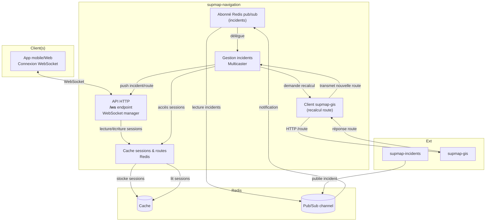
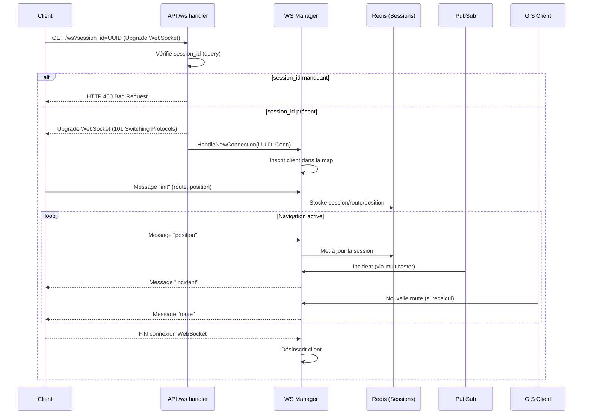
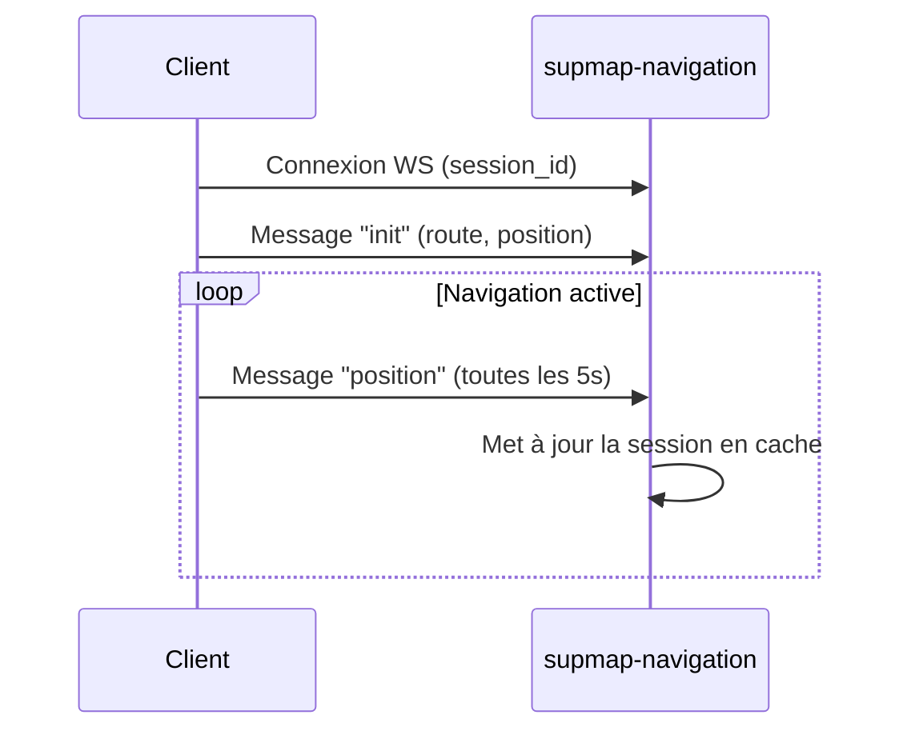
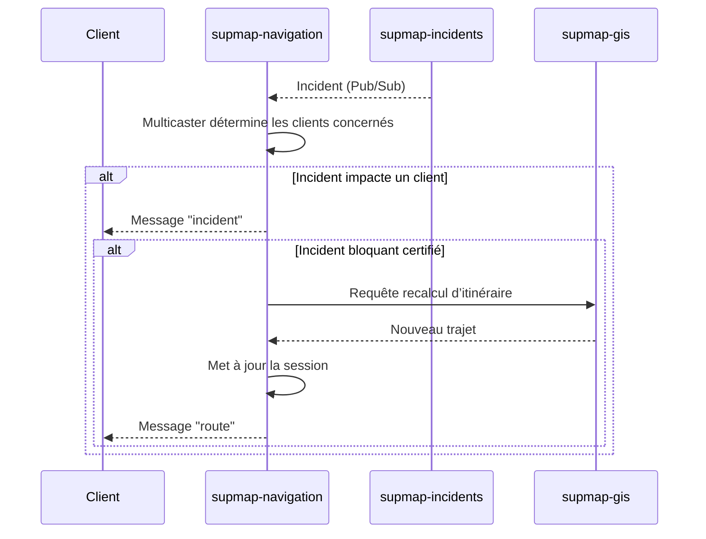
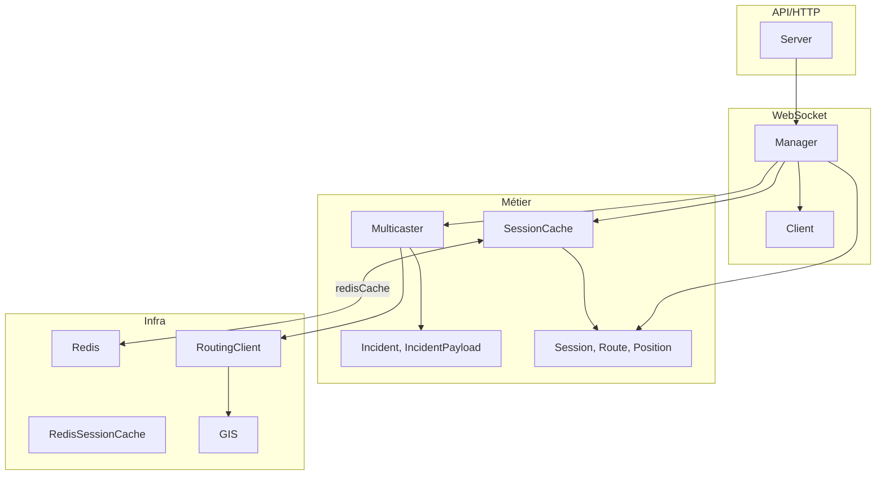
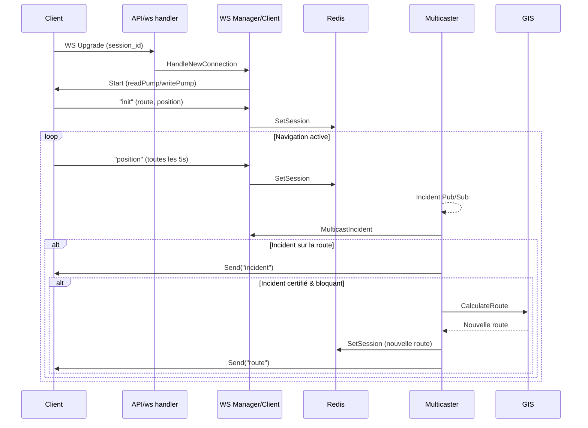

# supmap-navigation

## 1. Introduction

### 1.1. Rôle du microservice

**supmap-navigation** est le microservice dédié à la gestion de la navigation en temps réel pour les utilisateurs de l’application Supmap. Il établit et maintient des connexions WebSocket avec les clients mobiles afin de :
- Suivre en direct la position de chaque utilisateur pendant leur trajet.
- Diffuser instantanément les nouveaux incidents signalés sur leur itinéraire.
- Gérer les recalculs de route à la volée en cas d’événement perturbateur (ex : accident, embouteillage).

### 1.2. Principales responsabilités

- **Connexion WebSocket et gestion de session :**  
  Chaque client ouvre une connexion WebSocket identifiée par un `session_id` unique (UUID). Le serveur conserve en cache les informations de navigation et les positions des clients grâce à Redis.

- **Suivi de position :**  
  Les clients envoient régulièrement leur position. Le service met à jour le cache et peut ainsi déterminer à tout moment l’avancement de l’utilisateur sur son trajet.

- **Diffusion d’incidents en temps réel :**  
  Lorsqu’un nouvel incident est détecté ou modifié (via le microservice supmap-incidents), supmap-navigation est notifié via un canal Pub/Sub Redis. Il transmet alors en temps réel l’incident aux clients concernés, c’est-à-dire ceux dont l’itinéraire croise la zone de l’incident.

- **Recalcul dynamique des itinéraires :**  
  Si un incident nécessite le recalcul de la route (incident bloquant et certifié…), le service interroge supmap-gis pour obtenir un nouvel itinéraire. Ce nouvel itinéraire est ensuite envoyé au(x) client(s) via la connexion WebSocket, assurant une navigation optimisée en permanence.

### 1.3. Technologies et dépendances externes

- **Go** : langage principal du microservice.
- **WebSocket** : communication temps réel bidirectionnelle avec les clients.
- **Redis** : 
  - Stockage temporaire (cache) des sessions, routes et positions clients.
  - Mécanisme Pub/Sub pour recevoir en direct les incidents depuis supmap-incidents.
- **supmap-gis** : microservice utilisé pour le recalcul d’itinéraires en cas d’incident bloquant.
- **supmap-incidents** : source des incidents signalés sur le réseau via Redis Pub/Sub.
- **GitHub Actions** : CI pour build/push l’image Docker sur le registre GHCR du repo.

---

## 2. Architecture générale

### 2.1. Schéma d’architecture



### 2.2. Description des interactions internes et externes

- **Client (mobile)** :  
  Ouvre une connexion WebSocket sur `/ws` avec un `session_id` (UUID généré). Envoie ses infos d’itinéraire et régulièrement sa position.

- **API HTTP / WebSocket manager** :  
  Gère l’ouverture, le cycle de vie et la fermeture des connexions WebSocket. Chaque client correspond à une session identifiée et mappée sur une instance interne.

- **Cache Redis** :
    - Stocke les sessions de navigation : dernière position, itinéraire courant.
    - Permet de récupérer l’état d’une session à tout instant, pour tous les modules (manager, incidents…).

- **Abonné Redis Pub/Sub** :
    - S’abonne au canal d’incidents publié par **supmap-incidents**.
    - À la réception d’un message d’incident, délègue la gestion au **Multicaster**.

- **Gestionnaire d’incidents (Multicaster)** :
    - Détermine quels clients (sessions actives) sont concernés par l’incident.
    - Push l’incident en temps réel uniquement aux clients concernés via WebSocket.
    - Si l’incident nécessite un recalcul de route, il interroge le service **supmap-gis**, met à jour la session et push la nouvelle route au(x) client(s) impacté(s).

- **Client supmap-gis** :
    - Interagit avec le microservice **supmap-gis** via HTTP pour recalculer un itinéraire si besoin (en cas d’incident bloquant et certifié).

- **supmap-incidents** :
    - Publie les incidents sur le canal Pub/Sub Redis, ce qui déclenche la chaîne de notifications côté navigation.

### 2.3. Présentation des principaux composants

- **API HTTP/WebSocket (internal/api, internal/ws)** :  
  Expose l’unique endpoint `/ws` pour la navigation temps réel ; chaque nouvelle connexion est gérée comme un client identifié (`session_id`).

- **Cache Redis (internal/cache)** :  
  Abstraction pour stocker et lire les objets de session. TTL configurable.

- **Gestionnaire d’incidents (internal/incidents/multicaster.go)** :  
  Logique pour déterminer si un incident touche un client, envoyer la notification et déclencher le recalcul de route si nécessaire.

- **Abonné Pub/Sub (internal/subscriber)** :  
  S’abonne au canal Redis des incidents, désérialise les messages et transmet au multicaster.

- **Client GIS (internal/gis/routing/client.go)** :  
  Client HTTP vers supmap-gis pour demander un recalcul d’itinéraire.

- **Session navigation (internal/navigation)** :  
  Struct représentant l’état d’une navigation en cours : route, position, timestamps…

---

## 3. Organisation du projet et Structure des dossiers

### 3.1. Arborescence commentée

```
supmap-navigation/
├── cmd/
│   └── main.go                  # Point d'entrée du microservice
├── internal/
│   ├── api/                     # API HTTP : serveur, handler, routing
│   │   ├── handler.go           # Handler du endpoint /ws (connexion WebSocket)
│   │   └── server.go            # Démarrage et gestion du serveur HTTP
│   ├── cache/                   # Cache des sessions de navigation (Redis)
│   │   └── redis.go             # Abstraction pour stocker/récupérer les sessions navigation
│   ├── config/                  # Chargement, parsing de la configuration (variables d'env)
│   ├── gis/                     # Fonctions géospatiales & client supmap-gis
│   │   ├── polyline.go          # Calculs/distances sur polylines (utile incidents)
│   │   └── routing/
│   │       └── client.go        # Client HTTP pour interroger supmap-gis (recalcul d'itinéraire)
│   ├── incidents/               # Gestion de la diffusion des incidents
│   │   └── multicaster.go       # Multicast incidents/nouvelles routes aux clients concernés
│   ├── navigation/              # Structures de navigation (sessions, routes, points…)
│   │   └── session.go           # Structs : Session, Position, Route, Point, etc.
│   ├── subscriber/              # Abonné Redis Pub/Sub aux incidents
│   │   ├── subscriber.go        # Logique d'abonnement et de dispatch au multicaster
│   │   └── types.go             # Types pour désérialiser les messages incidents
│   └── ws/                      # Gestion WebSocket : clients, manager, messaging
│       ├── client.go            # Logique d'un client WebSocket (lifecycle, messaging)
│       └── manager.go           # Manager central des clients WebSocket
└── ...
```

### 3.2. Rôle de chaque dossier/fichier principal

#### 3.2.1. cmd/

- **main.go**  
  Point d’entrée du service : instancie la config, connecte Redis, démarre les managers, serveurs et workers.

#### 3.2.2. internal/api/

- **server.go**  
  Serveur HTTP principal, expose `/ws` (WebSocket) et `/health`.
- **handler.go**  
  Handler pour la connexion WebSocket, gestion du handshake et vérification du paramètre `session_id`.

#### 3.2.3. internal/cache/

- **redis.go**  
  Abstraction pour stocker/récupérer une session navigation dans Redis (opérations Set/Get/Delete).

#### 3.2.4. internal/config/

- Chargement et parsing des variables d’environnement (hôtes, ports, Redis, etc).

#### 3.2.5. internal/gis/

- **polyline.go**  
  Fonctions utilitaires pour les calculs géospatiaux (distance point-polyline, etc).
- **routing/client.go**  
  Client HTTP pour appeler supmap-gis lors du recalcul d’itinéraire.

#### 3.2.6. internal/incidents/

- **multicaster.go**  
  Logique de multicasting des incidents :
    - Vérifie si un incident concerne la route d’un client.
    - Push l’incident à la session concernée.
    - Déclenche un recalcul de route si besoin.

#### 3.2.7. internal/navigation/

- **session.go**  
  Structures métier pour une session de navigation (Session, Position, Route, Point, etc).

#### 3.2.8. internal/subscriber/

- **subscriber.go**  
  S’abonne au canal Redis Pub/Sub des incidents, désérialise les messages, relaie au multicaster.
- **types.go**  
  Types pour la désérialisation des messages incidents reçus.

#### 3.2.9. internal/ws/

- **manager.go**  
  Manager WebSocket central :
    - Gère l’ensemble des clients connectés.
    - Dispatch les messages (broadcast, ciblé…).
    - Enregistrement/déconnexion.
- **client.go**  
  Représentation d’un client WebSocket individuel :
    - Gestion du lifecycle, envoi/réception de messages, ping/pong.

---

## 4. Détail des services internes

### 4.1. Gestion des sessions de navigation (`internal/navigation`, `internal/cache`)

#### 4.1.1. Rôle
- Représente l’état de navigation d’un utilisateur : itinéraire courant, dernière position, timestamp de mise à jour.
- Permet de persister et de retrouver à tout instant l’état d’une session (utile pour la diffusion des incidents, le recalcul de route, etc).

#### 4.1.2. Dépendances
- **Redis** (via `internal/cache/redis.go`) pour le stockage temporaire des sessions.
- Utilisé par le WebSocket manager, le multicaster d’incidents et le subscriber.

#### 4.1.3. Principales méthodes
- **SessionCache (interface)** :
    - `SetSession(ctx, session) error` : Ajoute ou met à jour une session en cache.
    - `GetSession(ctx, sessionID) (*Session, error)` : Récupère l’état d’une session via son ID.
    - `DeleteSession(ctx, sessionID) error` : Supprime la session du cache.

### 4.2. WebSocket Manager et clients (`internal/ws`)

#### 4.2.1. Rôle
- Gère toutes les connexions WebSocket actives (un client = une session).
- Assure l’inscription/désinscription des clients, le broadcast des messages, et la gestion fine des canaux (ping/pong, déconnexions…).
- Route les messages reçus côté client (init, position) et côté serveur (incident, route recalculée).

#### 4.2.2. Dépendances
- S’appuie sur le cache session pour la persistance et la cohérence des états utilisateurs.
- Interagit avec le multicaster d’incidents pour pousser les messages incidents/routes.

#### 4.2.3. Principales méthodes
- **Manager** :
    - `Start()` : Boucle principale, écoute inscriptions/désinscriptions/messages.
    - `Broadcast(message)` : Broadcast d’un message à tous les clients.
    - `HandleNewConnection(id, conn)` : Création et démarrage d’un nouveau client WebSocket.
    - `ClientsUnsafe()`, `RLock()`, `RUnlock()` : Gestion thread-safe des clients.
- **Client** :
    - `Start()` : Démarre les goroutines de lecture/écriture pour la connexion.
    - `Send(msg)` : Envoie un message (avec gestion du buffer, déconnexion si bloqué).
    - `handleMessage(msg)` : Routage des messages reçus (init, position…).

### 4.3. API HTTP (`internal/api`)

#### 4.3.1. Rôle
- Expose l’endpoint `/ws` (WebSocket) et `/health` (vérification de vie).
- Effectue la première validation (`session_id`), puis délègue la gestion de la connexion au WebSocket manager.

#### 4.3.2. Dépendances
- WebSocket manager (gestion des connexions)

#### 4.3.3. Principales méthodes
- **Server** :
    - `Start(ctx)` : Démarrage du serveur HTTP, gestion propre du shutdown.
    - `wsHandler()` : Handler HTTP pour l’upgrade WebSocket (contrôle du paramètre `session_id`).

### 4.4. Cache Redis (`internal/cache`)

#### 4.4.1. Rôle
- Fournit un cache persistant et performant pour les sessions de navigation.
- Permet de stocker, récupérer et supprimer l’état d’une session utilisateur.

#### 4.4.2. Dépendances
- Client Redis (`github.com/redis/go-redis/v9`)
- Utilisé par le WebSocket manager, le multicaster d’incidents, et le subscriber.

#### 4.4.3. Principales méthodes/fonctions
- `NewRedisSessionCache(client, ttl)` : Constructeur de la structure cache.
- `SetSession(ctx, session)` / `GetSession(ctx, sessionID)` / `DeleteSession(ctx, sessionID)` : Opérations CRUD sur les sessions.

### 4.5. Abonné Pub/Sub Redis (`internal/subscriber`)

#### 4.5.1. Rôle
- S’abonne au canal Pub/Sub Redis où sont publiés les incidents par le microservice supmap-incidents.
- Désérialise les messages incidents et délègue au multicaster la notification aux clients concernés.

#### 4.5.2. Dépendances
- Client Redis
- Multicaster d’incidents

#### 4.5.3. Principales méthodes/fonctions
- `Start(ctx)` : Boucle d’abonnement au canal Redis, gestion du pool de workers pour traiter les incidents.
- `handleMessage(ctx, msg)` : Désérialisation et dispatch d’un message incident au multicaster.

### 4.6. Gestionnaire/MultiDiffuseur d’Incidents (`internal/incidents/multicaster.go`)

#### 4.6.1. Rôle
- Détermine dynamiquement quels clients sont concernés par un incident (en fonction de la route).
- Envoie l’incident (ou le recalcul d’itinéraire) en temps réel uniquement aux clients concernés.
- Si besoin, déclenche un recalcul d’itinéraire via le client GIS et met à jour la session.

#### 4.6.2. Dépendances
- WebSocket manager (pour accéder à tous les clients connectés)
- SessionCache (pour lire/mettre à jour les routes)
- Client GIS (pour le recalcul d’itinéraire)

#### 4.6.3. Principales méthodes/fonctions
- `MulticastIncident(ctx, incident, action)` : Parcourt tous les clients, détecte qui est concerné et leur push le bon message.
- `isIncidentOnRoute(incident, session)` : Vérifie la proximité de l’incident sur la route du client.
- `handleRouteRecalculation(ctx, client, session)` : Gère l’appel GIS, update la session, push la nouvelle route.
- `sendIncident(client, incident, action)` : Push un message incident à un client.

### 4.7. Client GIS (`internal/gis/routing`)

#### 4.7.1. Rôle
- Communique avec le microservice supmap-gis pour recalculer des itinéraires.
- Utilisé lors de la certification d’un incident bloquant.

#### 4.7.2. Dépendances
- HTTP Client standard
- supmap-gis (microservice)

#### 4.7.3. Principales méthodes/fonctions
- `NewClient(baseURL)` : Instancie le client GIS.
- `CalculateRoute(ctx, routeRequest)` : Fait un POST `/route` à supmap-gis, récupère et désérialise la réponse.

---

## 5. Endpoint HTTP exposé

### 5.1. Tableau récapitulatif

| Méthode | Chemin | Description                                    | Paramètres obligatoires |
|---------|--------|------------------------------------------------|-------------------------|
| GET     | /ws    | Connexion WebSocket pour navigation temps réel | `session_id` (query)    |

### 5.2. Détail de l’endpoint `/ws`

#### 5.2.1. Description fonctionnelle

L’endpoint `/ws` permet à un client (mobile) d’ouvrir une connexion WebSocket persistante avec le service **supmap-navigation** afin de :

- Suivre et mettre à jour sa position en temps réel.
- Recevoir des notifications d’incidents sur son itinéraire.
- Être notifié immédiatement d’un recalcul d’itinéraire si nécessaire.

Chaque connexion WebSocket correspond à une session de navigation unique, identifiée par un identifiant `session_id` fourni par le client (UUID généré côté client).

#### 5.2.2. Méthode + chemin

- **Méthode** : `GET`
- **Chemin** : `/ws`

#### 5.2.3. Paramètres d’ouverture

| Type  | Nom        | Emplacement | Obligatoire | Description                                         |
|-------|------------|-------------|-------------|-----------------------------------------------------|
| query | session_id | Query       | Oui         | Identifiant unique de la session (UUID côté client) |


Aucun header particulier n’est requis.

#### 5.2.4. Exemple d’ouverture de connexion

**Requête WebSocket (HTTP Upgrade) :**
```
GET /ws?session_id=123e4567-e89b-12d3-a456-426614174000 HTTP/1.1
Host: navigation.supmap.local
Connection: Upgrade
Upgrade: websocket
Origin: https://app.supmap.local
Sec-WebSocket-Key: xxxxx==
Sec-WebSocket-Version: 13
...
```

**Code JS côté client (exemple, ce n'est pas le vrai code) :**
```js
const sessionId = '123e4567-e89b-12d3-a456-426614174000';
const ws = new WebSocket(`wss://navigation.supmap.local/ws?session_id=${sessionId}`);

ws.onopen = () => {
  // Envoi du message "init" contenant la route et la position
};
```

#### 5.3. Description du flux de traitement

**Résumé textuel :**

1. **Connexion** :  
   Le client tente d’ouvrir une connexion WebSocket sur `/ws` en passant son `session_id` en query.
2. **Validation** :  
   Le serveur vérifie la présence du paramètre `session_id`. Si absent, la connexion est refusée.
3. **Upgrade et gestion** :  
   Si OK, la connexion est acceptée, un client WebSocket est instancié et enregistré auprès du manager.
4. **Échange initial** :  
   Le client envoie un message `init` contenant sa route et sa position actuelle.
5. **Traitement en continu** :
    - Le client envoie périodiquement des positions (`position`).
    - Le serveur push incidents et nouveaux itinéraires si besoin.
    - La connexion reste ouverte tant que la session est active (ou jusqu’à déconnexion).
6. **Déconnexion** :  
   À la fermeture, le client est désinscrit du manager, la connexion WebSocket est fermée proprement.

#### 5.4. Diagramme de séquence du traitement



---

## 6. Protocole & messages WebSocket

### 6.1. Tableau récapitulatif des types de messages

| Sens                | Type       | Description                                          |
|---------------------|------------|------------------------------------------------------|
| Client → Serveur    | `init`     | Initialisation de la session (route, position)       |
| Client → Serveur    | `position` | Envoi périodique de la position                      |
| Serveur → Client    | `incident` | Notification d’un incident impactant l’itinéraire    |
| Serveur → Client    | `route`    | Transmission d’un nouvel itinéraire recalculé        |

### 6.2. Structure générale des messages

Tout message échangé a la forme :

```json
{
  "type": "TYPE_MESSAGE",
  "data": { ... }
}
```

- `type` : Type du message (voir tableau ci-dessus)
- `data` : Données associées, dont la structure dépend du type

### 6.3. Messages Client → Serveur

#### 6.3.1. `init`

**But** : Initialiser la session côté serveur (première connexion), transmettre la route et la position courante du client.

**Structure attendue :**
```json
{
  "type": "init",
  "data": {
    "session_id": "e38d5757-5359-44b3-ab6e-8c619e3daba0",
    "last_position": {
      "lat": 49.171669,
      "lon": -0.582579,
      "timestamp": "2025-05-06T20:52:30Z"
    },
    "route": {
      "polyline": [
        { "latitude": 49.171669, "longitude": -0.582579 },
        ...,
        { "latitude": 49.201345, "longitude": -0.392996 }
      ],
      "locations": [
        { "lat": 49.17167279051877, "lon": -0.5825858234777268 },
        { "lat": 49.20135359834111, "lon": -0.3930605474075204 }
      ]
    },
    "updated_at": "2025-05-06T20:52:30Z"
  }
}
```

**Description des champs :**
- `session_id` : UUID de la session (identique à celui passé lors de la connexion WebSocket)
- `last_position` : Position actuelle (lat, lon, timestamp)
- `route.polyline` : Liste des points composant la polyline de l’itinéraire
- `route.locations` : Points d’arrêt (départ, arrivée, étapes)
- `updated_at` : Date de la dernière mise à jour de la session

#### 6.3.2. `position`

**But :** Mise à jour de la position courante du client à intervalles réguliers (ex : toutes les cinq secondes).

**Structure attendue :**
```json
{
  "type": "position",
  "data": {
    "lat": 49.1943057668118,
    "lon": -0.44595408906894096,
    "timestamp": "2025-05-07T10:07:00Z"
  }
}
```

**Description des champs :**
- `lat`, `lon` : Coordonnées GPS de la position courante
- `timestamp` : Date et heure de la mesure

### 6.4. Messages Serveur → Client

#### 6.4.1. `incident`

**But :** Notifier le client qu’un incident a été signalé, supprimé ou certifié sur son itinéraire.

**Structure attendue :**
```json
{
  "type": "incident",
  "data": {
    "incident": {
      "id": 26,
      "user_id": 2,
      "type": {
        "id": 3,
        "name": "Embouteillage",
        "description": "Circulation fortement ralentie ou à l’arrêt.",
        "need_recalculation": true
      },
      "lat": 49.19477822,
      "lon": -0.3964915,
      "created_at": "2025-05-09T14:57:36.96141Z",
      "updated_at": "2025-05-09T14:57:36.96141Z"
    },
    "action": "create"
  }
}
```

**Description des champs :**
- `incident`: Objet décrivant l’incident
    - `id`: Identifiant unique
    - `user_id`: Utilisateur ayant signalé l’incident
    - `type`: Type d’incident (nom, description, recalcul requis…)
    - `lat`, `lon`: Position de l’incident
    - `created_at`, `updated_at`: Dates de création/mise à jour
    - `deleted_at` (optionnel) : Date de suppression si l’incident est supprimé
- `action`: `"create"`, `"certified"` ou `"deleted"`

#### 6.4.2. `route`

**But :** Transmettre un nouvel itinéraire recalculé à la suite d’un incident bloquant certifié.

**Structure attendue :**
```json
{
  "type": "route",
  "data": {
    "route": {
      "locations": [
        { "lat": 49.194305, "lon": -0.445954, "type": "break", "original_index": 0 },
        { "lat": 49.201353, "lon": -0.39306, "type": "break", "original_index": 1 }
      ],
      "legs": [
        {
          "maneuvers": [
            {
              "type": 1,
              "instruction": "Conduisez vers l'est sur N 13/E 46.",
              "street_names": [ "N 13", "E 46" ],
              "time": 11.75,
              "length": 0.293,
              "begin_shape_index": 0,
              "end_shape_index": 1
            },
            ...,
            {
              "type": 4,
              "instruction": "Vous êtes arrivé à votre destination.",
              "street_names": [],
              "time": 0, "length": 0,
              "begin_shape_index": 297,
              "end_shape_index": 297
            }
          ],
          "summary": { "time": 448.775, "length": 6.349 },
          "shape": [
            { "latitude": 49.194309, "longitude": -0.445953 },
            ...,
            { "latitude": 49.201345, "longitude": -0.392996 }
          ]
        }
      ],
      "summary": { "time": 448.775, "length": 6.349 }
    },
    "info": "recalculated_due_to_incident"
  }
}
```

**Description des champs :**
- `route`: Nouvel itinéraire complet (même structure que lors du calcul initial avec supmap-gis)
- `info`: Raison du recalcul (ex : `"recalculated_due_to_incident"`)

### 6.5. Flux typiques et diagrammes de séquence

#### 6.5.1. Flux initialisation et suivi de position



#### 6.5.2. Flux notification d’incident et recalcul d’itinéraire



---

## 7. Structures & interfaces importantes

### 7.1. Structures principales

#### 7.1.1. Session de navigation (`internal/navigation/session.go`)

```go
type Session struct {
	ID           string    `json:"session_id"`
	LastPosition Position  `json:"last_position"`
	Route        Route     `json:"route"`
	UpdatedAt    time.Time `json:"updated_at"`
}
type Position struct {
	Lat       float64   `json:"lat"`
	Lon       float64   `json:"lon"`
	Timestamp time.Time `json:"timestamp"`
}
type Route struct {
	Polyline  []Point    `json:"polyline"`
	Locations []Location `json:"locations"`
}
type Point struct {
	Lat float64 `json:"latitude"`
	Lon float64 `json:"longitude"`
}
type Location struct {
	Lat float64 `json:"lat"`
	Lon float64 `json:"lon"`
}
```
- **Usage** : représente l’état complet d’une navigation utilisateur (position, itinéraire, timestamps, etc).

#### 7.1.2. Message WebSocket (`internal/ws/client.go`)

```go
type Message struct {
	Type string          `json:"type"`
	Data json.RawMessage `json:"data"`
}
```
- **Usage** : enveloppe tout message WebSocket échangé (type + payload générique).

#### 7.1.3. Client WebSocket (`internal/ws/client.go`)

```go
type Client struct {
	ID      string
	Conn    *websocket.Conn
	Manager *Manager
	send    chan Message
	ctx     context.Context
	cancel  context.CancelFunc
}
```
- **Usage** : représente une connexion WebSocket active côté serveur (1 client = 1 session de navigation).

#### 7.1.4. Incident et payload (`internal/incidents/types.go`)

```go
type IncidentPayload struct {
	Incident *Incident `json:"incident"`
	Action   string    `json:"action"`
}
type Incident struct {
	ID        int64      `json:"id"`
	UserID    int64      `json:"user_id"`
	Type      *Type      `json:"type"`
	Lat       float64    `json:"lat"`
	Lon       float64    `json:"lon"`
	CreatedAt time.Time  `json:"created_at"`
	UpdatedAt time.Time  `json:"updated_at"`
	DeletedAt *time.Time `json:"deleted_at,omitempty"`
}
type Type struct {
	ID                int64  `json:"id"`
	Name              string `json:"name"`
	Description       string `json:"description"`
	NeedRecalculation bool   `json:"need_recalculation"`
}
```

- **Usage** : incidents de circulation, utilisés pour notifier le client et déclencher un éventuel recalcul de route.

#### 7.1.5. Manager WebSocket (`internal/ws/manager.go`)

```go
type Manager struct {
	clients      map[string]*Client
	register     chan *Client
	unregister   chan *Client
	broadcast    chan Message
	mu           sync.RWMutex
	ctx          context.Context
	cancel       context.CancelFunc
	logger       *slog.Logger
	sessionCache navigation.SessionCache
}
```
- **Usage** : composant central qui pilote tous les clients WebSocket et la diffusion des messages.

### 7.2. Interfaces métier utiles

#### 7.2.1. SessionCache (`internal/navigation/session.go`)

```go
type SessionCache interface {
	SetSession(ctx context.Context, session *Session) error
	GetSession(ctx context.Context, sessionID string) (*Session, error)
	DeleteSession(ctx context.Context, sessionID string) error
}
```
- **Usage** : abstraction pour le cache des sessions (implémentée par Redis, mais testable/mockable).

#### 7.2.2. Multicaster d'incidents (`internal/incidents/multicaster.go`)

```go
type Multicaster struct {
	Manager       *ws.Manager
	SessionCache  navigation.SessionCache
	RoutingClient *routing.Client
}
```
- **Usage** : service qui détermine les clients impactés par un incident et les notifie (voire déclenche un recalcul).

### 7.3. Autres structures clés

- **Server** (`internal/api/server.go`) : struct qui encapsule la config, le manager WebSocket et le logger pour le serveur HTTP.
- **RedisSessionCache** (`internal/cache/redis.go`) : implémentation concrète de `SessionCache` via Redis.
- **Point** (`internal/gis/polyline.go`) : structure géographique pour les calculs de distances/incidents.

### 7.4. Diagramme de dépendances principales



---

## 8. Stack trace & appels typiques

### 8.1. Stack trace d’un flux complet (messages WebSocket)

#### a) Connexion et initialisation

1. **Client → Serveur :** Ouverture WebSocket (`/ws?session_id=...`)
2. **internal/api/handler.go**
    - `wsHandler()` (HTTP → WS upgrade)
    - Appelle `ws.Manager.HandleNewConnection(sessionID, conn)`
3. **internal/ws/manager.go**
    - `HandleNewConnection(id, conn)` → crée un `ws.Client` et lance `Start()`
4. **internal/ws/client.go**
    - `Client.Start()` → lance `readPump()` et `writePump()`
5. **Client → Serveur :** Envoi du message `"init"`
6. **internal/ws/client.go**
    - `handleMessage(msg)` : case `"init"`
    - Désérialise `navigation.Session` et vérifie l’ID
    - Appelle `SessionCache.SetSession(ctx, &session)`

#### b) Mise à jour de position

1. **Client → Serveur :** Message `"position"`
2. **internal/ws/client.go**
    - `handleMessage(msg)` : case `"position"`
    - Appelle `SessionCache.GetSession(ctx, sessionID)`
    - Met à jour la position dans la session
    - Appelle `SessionCache.SetSession(ctx, session)`

#### c) Réception d’un incident

1. **Incident Pub/Sub (supmap-incidents → Redis)**
2. **internal/subscriber/subscriber.go**
    - `Subscriber.Start(ctx)` reçoit le message
    - Appelle `Multicaster.MulticastIncident(ctx, incident, action)`
3. **internal/incidents/multicaster.go**
    - `Multicaster.MulticastIncident()` : boucle sur les clients WebSocket concernés
    - Si besoin, appelle `handleRouteRecalculation()` (recalcul GIS)
    - Appelle `sendIncident()` → `Client.Send()` (message `"incident"`)
4. **internal/ws/client.go**
    - `writePump()` envoie le message `"incident"` au client

#### d) Recalcul d’itinéraire (sur incident bloquant certifié)

1. **internal/incidents/multicaster.go**
    - `handleRouteRecalculation()` :
        - Construit une requête GIS
        - Appelle `routing.Client.CalculateRoute(ctx, req)`
        - Met à jour la session (nouvelle route)
        - Appelle `Client.Send()` (message `"route"`)

### 8.2. Signatures des fonctions principales impliquées

```go
// internal/api/handler.go
func (s *Server) wsHandler() http.HandlerFunc

// internal/ws/manager.go
func (m *Manager) HandleNewConnection(id string, conn *websocket.Conn)
func (m *Manager) Start()

// internal/ws/client.go
func (c *Client) Start()
func (c *Client) handleMessage(msg Message)
func (c *Client) Send(msg Message)
func (c *Client) readPump()
func (c *Client) writePump()

// internal/navigation/session.go
func (r *RedisSessionCache) SetSession(ctx context.Context, session *navigation.Session) error
func (r *RedisSessionCache) GetSession(ctx context.Context, sessionID string) (*navigation.Session, error)

// internal/subscriber/subscriber.go
func (s *Subscriber) Start(ctx context.Context) error

// internal/incidents/multicaster.go
func (m *Multicaster) MulticastIncident(ctx context.Context, incident *Incident, action string)
func (m *Multicaster) handleRouteRecalculation(ctx context.Context, client *ws.Client, session *navigation.Session)
func (m *Multicaster) sendIncident(client *ws.Client, incident *Incident, action string)
```

### 8.3. Schéma de séquence illustratif

#### 8.3.1. Flux complet : init, position, incident, recalcul

> Ce schéma illustre le parcours d’un message WebSocket typique, depuis la connexion jusqu’à la gestion des incidents et le recalcul d’itinéraire, en montrant chaque acteur et fonction clef impliquée dans le flux.



---
